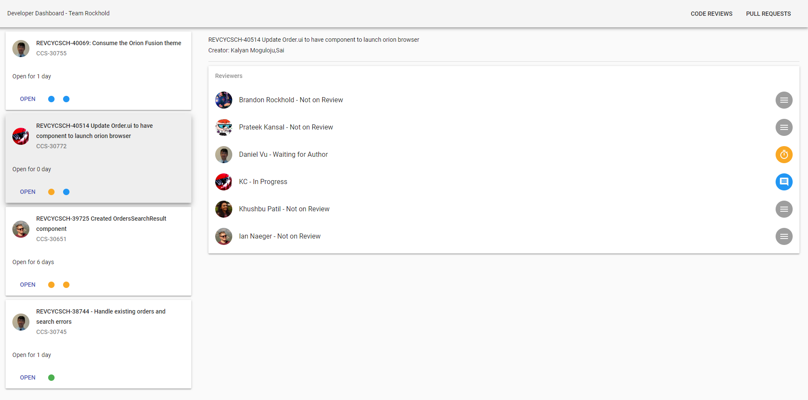

# Dev Dashboard

> Dashboard for tracking progress of code reviews

This project pulls data from Crucible's REST API for a specified set of users and displays them in a single dashboard.
From there, each individual user can mark which stage of a code review they are in. This allows finer control over who is
doing what and helps communicate progress being made.



## Prerequisites

### Software

To use the dev dashboard, you must install the following separately:

* [MongoDB](https://www.mongodb.com/)
  * The project is configured to store all data in a "dev-dashboard"
    database.
* [NodeJS](https://nodejs.org/en/)
  * Verified working with 8.8.1

It is recommended that MongoDB is set up as a "service" so that the
database will always be on while the web server is on.

### Environment Variables

This project uses various environment variables that must be set on the
host machine before running the project. The required keys and value formats
can be found in the .env.sample. The project is not currently configured
to take an environment variable configuration file so these variables must be
set on the machine itself.

### Customization

Inside of `src/constants.js`, there are variables that can be customized
for your team's needs, such as the Crucible URL and members of the team.
Adjust these variables before starting the server. The possible statuses
can be adjusted but need adjustments in the UI code as well.

## Usage

Once the prerequisites are installed, the NPM dependencies of this
project can be pulled using

```
npm install
```

The required files for execution can be compiled using

```
npm run build
```

The server can be started using

```
npm start
```

It can then be accessed under localhost:8000.
